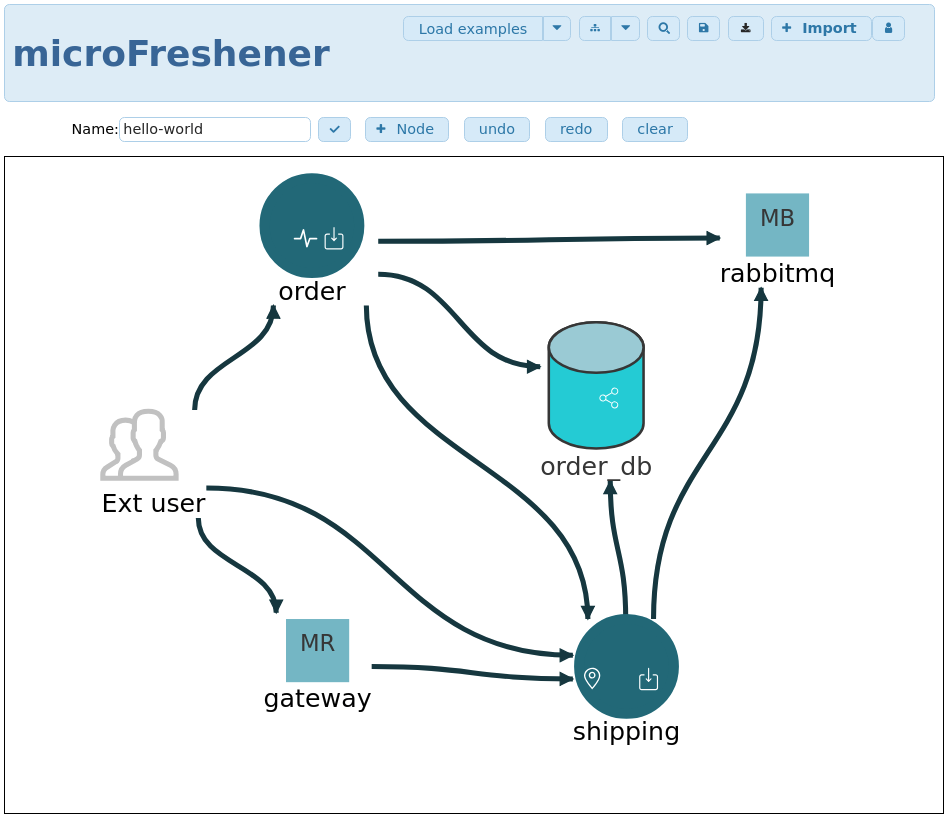

# MicroFreshener

MiICROFRESHENER is a web-based prototype that permits to identify the _architectural smells_ that possibly violate principles of microservices, and to select suitable _refactorings_ to resolve them.

The paper has been submitted to:
> _Antonio Brogi,  Davide Neri, Jacopo Soldani <br>
> **Freshening the air in microservices: Resolving architectural smells via refactoring.** <br>
> The 17th International Conference on Service-Oriented Computing (ICSOC), 2019 [Under review]._


## Table of Contents
- [MicroFreshener](#microfreshener-architecture)
  * [GUI](#web-based-interface)
  <!-- * [Internal architecture](#internal-architecture) -->
- [Quick Guide](#quick-guide)
  * [Installation](#installation)
  <!-- * [Example of usage](#example-of-usage) -->
- [License](#license)

## MicroFreshener architecture

## Web-based interface
`MicroFreshener` has a web-based interface that permits to :
- draw and edit the architectures of microservices
- analyse the architecture and 
- apply refactorings.

Examples of the web-based interface are shown below where:
 - (a) is an example of an architecture drawn with the GUI, where the icons on the nodes  are the architectural smells affecting such ndoes.
 - (b) is the view for choosing a refactoring.

  (a)       |  (b)
:-------------------------:|:-------------------------:
  |  

<!-- ## Internal Architecture
`MicroFreshener` architecture is composed by a backend and a frontend.

 -->


## Quick Guide
In order to run the `MicroFreshener` you should run the server and the client (for local use only).

## Installation
In order to use `MicroFreshener` you should first download the repository:

```
$ git clone git@github.com:di-unipi-socc/microFreshener.git
```

### Run the server
Enter in the server directotry 

```
$ cd /server
```

Create a virtual environment and install the python dependencies

```
$ virtualenv -p python3 venv  
$ source venv/bin/activate 
$ pip install -r requirements.txt 
```

Apply migrations

```
python manage.py migrate

```

Run the local server

```
python manage.py runserver

```

###  Run the client
The client is an Angular web application.

```
$ cd /client
```

Serve the client with a local server
```
$ sudo ng serve
```

Open the bowser on http://127.0.0.1:4200/.